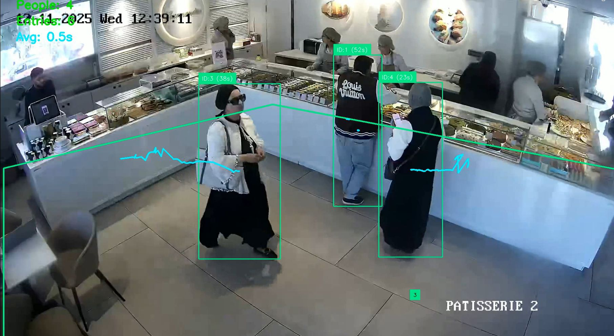
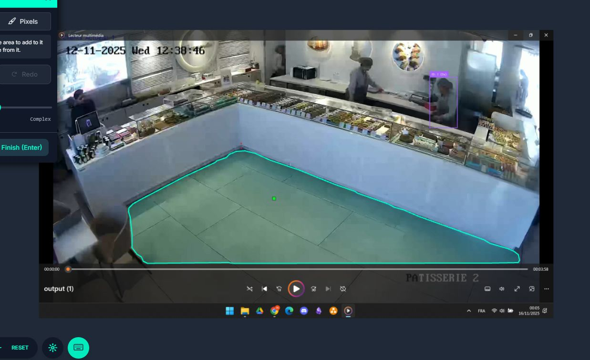

<div align="center">

# 🏪 AI Retail Analytics Platform

**Transform existing surveillance cameras into a powerful customer behavior intelligence system**

[](https://www.python.org/)
[](https://opencv.org/)
[](https://jupyter.org/)
[](https://ultralytics.com/)

[Overview](#-overview) · [Features](#-key-features) · [Demo](#-platform-screenshots) · [Workflow](#️-how-it-works) · [Getting Started](#-getting-started) · [Output](#-analytics--exports)

</div>

---

## 📌 Overview

An AI-powered video analytics platform that helps retail store owners understand customer movement and behavior inside their space — using their **existing surveillance infrastructure**, with zero hardware changes required.

The platform processes video streams to **detect, track, and analyze** each customer anonymously, from entry to key areas of the store. Store owners can define dynamic Regions of Interest (ROI) to target specific zones for in-depth analysis.

---

## ✨ Key Features

### 👣 Customer Movement Analysis
Processes surveillance camera footage to detect and track each customer across the entire store, providing a full picture of foot traffic patterns.

### 🎯 Dynamic ROI — Region of Interest
Define custom "green zones" (entrance, promo stand, checkout, etc.) directly on the video feed for targeted, zone-specific analysis.

### 🔢 Zone Counting
Logs every `ZONE_ENTER` and `ZONE_EXIT` event in real time as customers cross the defined ROI, enabling precise traffic measurement over any time period.

### ⏱️ Dwell Time Measurement
Calculates the average time customers spend inside a defined zone — a key metric for evaluating layout effectiveness and promotional engagement.

### 🛡️ Theft Alert Module
An advanced behavioral analysis module that flags abnormal or suspicious activity patterns to support loss prevention efforts.

### 📊 Analytics & Exports
Full reporting suite including annotated video, event logs, and visual charts — ready for business decision-making.

---

## 🖥️ Platform Screenshots

<table>
  <tr>
    <td align="center">
      
    </td>
    <td align="center">
      
    </td>
  </tr>
</table>

---

## 🏗️ How It Works

```
Surveillance Camera Feed (existing infrastructure)
          │
          ▼
   Object Detection (YOLOv8)
          │  detect customers per frame
          ▼
   Multi-Object Tracking
          │  assign persistent IDs
          ▼
   ROI Intersection Logic
          │  ZONE_ENTER / ZONE_EXIT events
          ▼
   Dwell Time Engine + Theft Alert Module
          │
          ▼
   Analytics Dashboard
   ├── Annotated video output
   ├── events.csv (entry/exit log)
   └── Charts: traffic · peak times · visit frequency
```

---

## 📁 Repository Structure

```
AI-Retail-Analytics-Platform/
├── script.ipynb        # Main pipeline: detection, tracking, ROI, analytics
├── 1.png               # Platform screenshot
├── 2.png               # Platform screenshot
└── README.md
```

---

## 🚀 Getting Started

### Prerequisites

- Python 3.10+
- A video file or camera feed (RTSP / webcam)

### Install Dependencies

```bash
pip install ultralytics opencv-python pandas matplotlib numpy
```

### Run the Pipeline

Open and execute the notebook:

```bash
jupyter notebook script.ipynb
```

The pipeline will:
1. Load the video stream
2. Detect and track customers frame by frame
3. Apply the defined ROI and log zone events
4. Compute dwell time statistics
5. Export results and generate the analytics dashboard

---

## 📤 Analytics & Exports

| Output | Description |
|---|---|
| 🎥 Annotated Video | Original footage with tracking overlays and ROI visualization |
| 📄 `events.csv` | Timestamped log of all `ZONE_ENTER` / `ZONE_EXIT` events |
| 📈 Traffic Chart | Visitor count over time with peak hour identification |
| ⏱️ Dwell Time Report | Average and per-customer time spent in each zone |
| 🚨 Alert Log | Flagged suspicious behaviors from the theft detection module |

---

## 💡 Use Cases

- 📍 **Store Layout Optimization** — Identify underperforming zones and rearrange displays
- 📣 **Promotion Effectiveness** — Measure ROI engagement before and after campaigns
- 🕐 **Peak Hour Planning** — Staff scheduling based on traffic heatmaps
- 🔒 **Loss Prevention** — Real-time alerts on abnormal behavioral patterns

---

## 📄 License

This project is intended for academic and research purposes only.

---

<div align="center">
  <sub>Built with 🎯 Computer Vision — turning cameras into business intelligence</sub>
</div>
